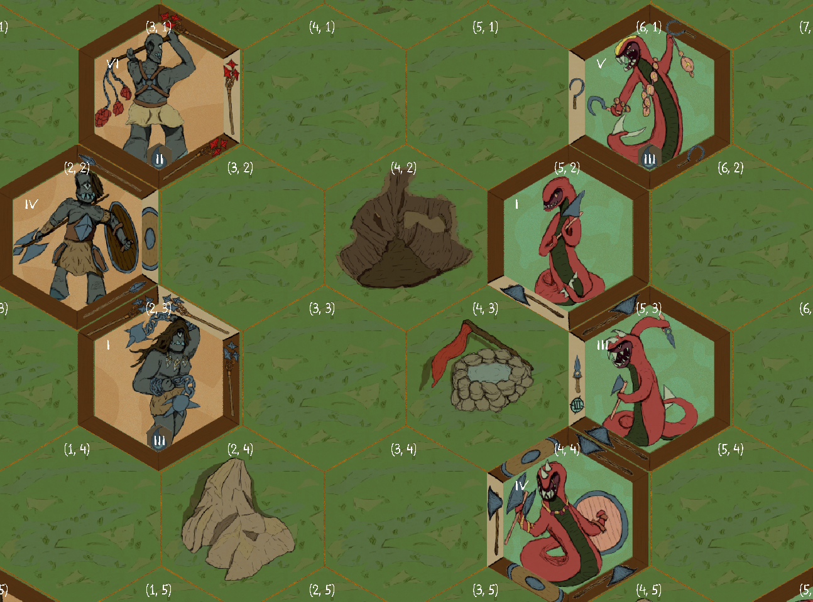

# Foray

It's an open source turn based strategy game, a mix between Chess and Heroes of Might and Magic.

Developed by members of "Krąg Godota", KNTG Polygon subcommunity organized by Wiolarz

 [Code documentation](Documentation/readme.md)

# Authors

## Active Contributors
- Wiolarz
- Pierożek (PieroganoReggiano)
- Carcinizer
- Bartollo
- Anka_AKAxTC

## Former Contributors
- Pavelee
- Trupen (MrTrupen)
- Mienso (ZimneMienso)
- Majones (FiloFelonFox)
- Toksyczna
- Deathguard12 (bartoszstepien01)
- Zephyr (NamespaceV)

## Alternative implementations

Project vision is a long running one. See previous implementations in other engines.

Unity - C#
- [https://github.com/defacto2k15/PolySpear](https://github.com/defacto2k15/PolySpear)

Unreal - C++
- [https://github.com/y3snt/Hegzy/tree/gameplay-refactor](https://github.com/y3snt/Hegzy/tree/gameplay-refactor)

# Older projects still present on this repository
Brawler and Shmup are the only somewhat playable games

 - [Krąg season 2: Brawler](https://github.com/Wiolarz/Foray/tree/K2Brawler)

 - [Krąg season 2: Schmup](https://github.com/Wiolarz/Foray/tree/K2Shmup)

 - [Krąg season 2:Kings Hunt](https://github.com/Wiolarz/Foray/tree/K2King's_Hunt)

 - [Krąg season 2: Text game](https://github.com/Wiolarz/Foray/tree/K2TextGame1)

 - [Krąg season 2: Stealth game](https://github.com/Wiolarz/Foray/tree/K2CrowdStealth)

 - [Krąg season 1: old and simple code experiments](https://github.com/Wiolarz/Foray/tree/season_1)

 - [Old Project template](https://github.com/Wiolarz/Foray/tree/Project_Template)
